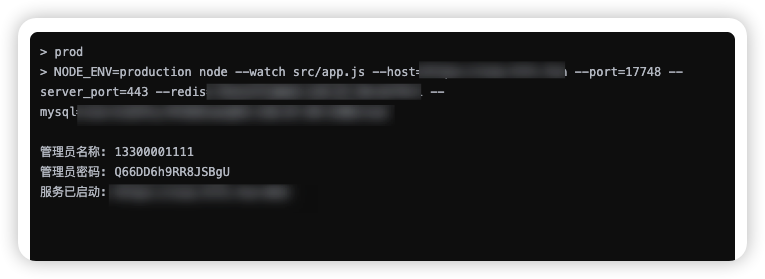
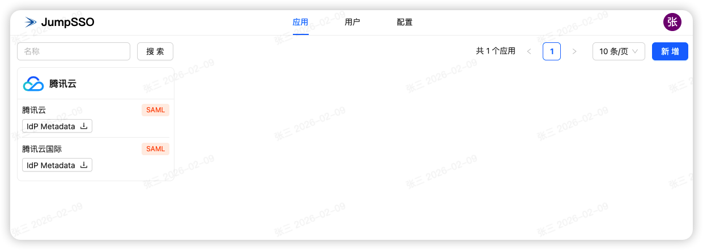
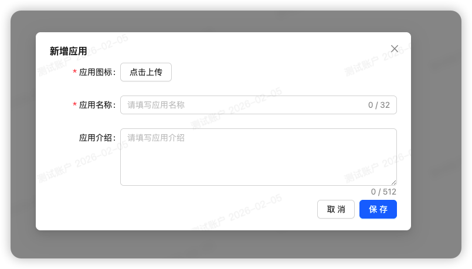
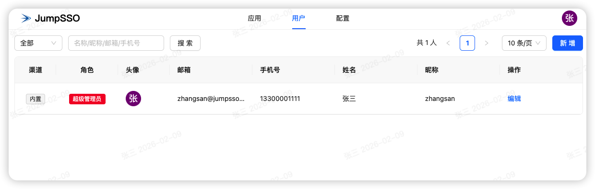
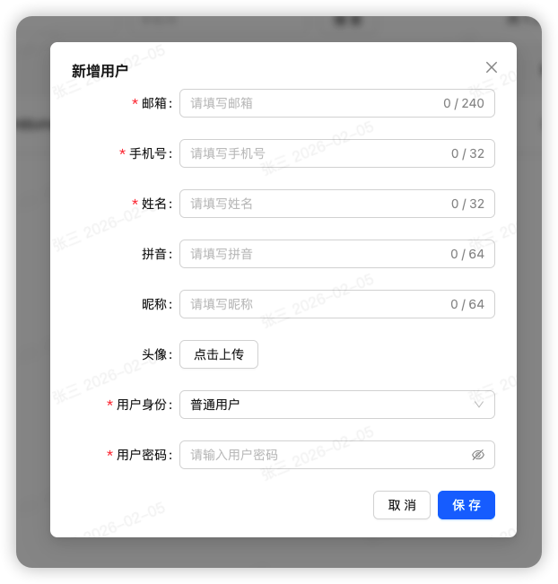

# 使用说明

部署后，您可以查看服务日志，得到相应信息，可通过浏览器访问服务地址，若重复部署则不会再显示账户信息，初始管理账户名为：13300001111

初始密码存储在 runtime/config.json 文件中，请注意，如果您在操作界面修改超级管理员密码，配置文件并不会同步更新

## 应用

在这里您可以创建应用，创建应用后，再创建对应入口，一个应用可创建多个入口，入口协议的 OIDC 和 SAML2 对比可自行了解，两者均是流行协议，此处简单描述一下：

- OIDC：协议较新，配置简单，支持单点登录的服务不一定支持，配置请阅读：[添加 OIDC 入口](oidc/README.md)
- SAML2：传统协议，配置较多，支持单点登录的服务基本都支持，配置请阅读：[添加 SAML 入口](saml/README.md)

下方是几个演示接入的服务，其他服务的配置方法大同小异，参考示例适当调整即可。

| 服务              | OIDC                               | SAML2                                    |
| ----------------- | ---------------------------------- | ---------------------------------------- |
| 阿里云/阿里云国际 |                                    | [接入文档](saml/aliyun/README.md)        |
| 腾讯云/腾讯云国际 |                                    | [接入文档](saml/tencent-cloud/README.md) |
| Gitlab            | [接入文档](oidc/gitlab/README.md)  |                                          |
| Jenkins           | [接入文档](oidc/jenkins/README.md) |                                          |

## 用户

在这里您可以查看 JumpSSO 所有的登录账户，账户类型分为：

- 内置：系统内置账户，除了用于授权登录应用，管理员和超级管理员还可以登录后台系统进行管理。
- 飞书：飞书账户同步展示，配置参考：[使用飞书作为身份源](user/feishu/README.md)
- 钉钉：钉钉账户同步展示，配置参考：[使用钉钉作为身份源](user/dingding/README.md)
- 企微：企微账户同步展示，配置参考：[使用企微作为身份源](user/qiwei/README.md)
- 飞牛：飞牛账户同步展示，配置参考：[使用飞牛作为身份源](user/feiniu/README.md)

创建时，仅可以创建内置账户，编辑时，内置账户可编辑角色和密码。

## 映射

在某些情况下，需要对用户的身份标识做映射，例如：

- 用户邮箱已经对外使用，但是内部系统用的是另一个名称
- 在某个应用里，多人使用一个账户

那么就可以使用映射功能，参考此文档：[使用映射功能进行灵活登录](user/mapping/README.md)

## 登出

你可以一键登出 JumpSSO，这样后续所有的应用在登录时就需要重新登录。

在 OIDC 和 SAML 相应的配置处均已支持。

具体的登出地址为：<你的 JumpSSO 部署地址>/sign/logout
