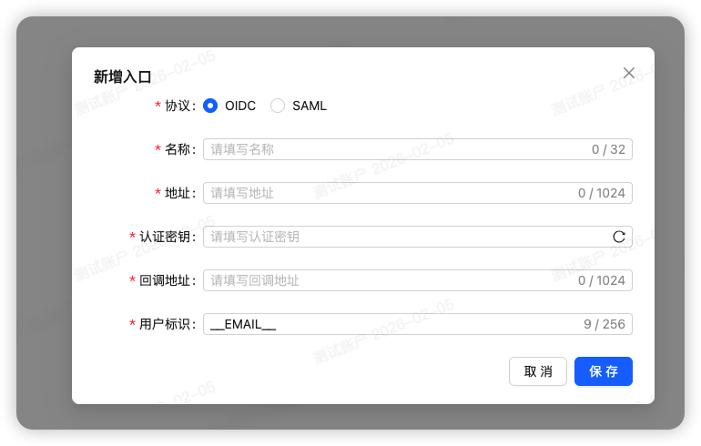

# 添加 OIDC 入口

添加入口时选择 OIDC，将有以下参数，详细填写参考下面说明



## 说明

### 基本信息

- 名称：入口名称，可填写该入口和应用的关系，比如阿里云-国际服
- 地址：入口地址，用户记录该入口从何处访问，比如阿里云：https://signin.aliyun.com/login.htm?username=@xxxx.onaliyun.com

### 密钥与回调

- 认证密钥：随机生成一个认证密钥，用户跳转登录时匹配入口。
- 回调地址：完成授权后携带 code 的跳转地址，具体地址查看每个服务的具体配置

### 传递用户信息

#### 用户标识

返回给服务商的用户唯一标识，为灵活，提供了一些拼接的方式，有几个占位变量：

| 占位符           | 值         |
| ---------------- | ---------- |
| \_\_EMAIL\_\_    | 用户邮箱   |
| \_\_PHONE\_\_    | 用户手机号 |
| \_\_NAME\_\_     | 用户名称   |
| \_\_NICKNAME\_\_ | 用户昵称   |

这些值对应了用户页面添加的信息，一般情况下，使用邮箱或手机号作为唯一标识，但对于一些特定的服务商，需要用其他信息。

## 关于 .well-known/openid-configuration

部署完成后，oidc 的配置文件位于：

- https://<你的 JumpSSO 部署地址>/oidc/.well-known/openid-configuration

但因为部署时存在反向代理等因素，这个配置文件的地址会存在一些问题，所以建议在各个服务配置时，优先直接指定对应服务的 URL：

| 类型                   | 值                                               | 说明                   |
| ---------------------- | ------------------------------------------------ | ---------------------- |
| issuer                 | https://<你的 JumpSSO 部署地址>/oidc             | OIDC 服务地址          |
| authorization_endpoint | https://<你的 JumpSSO 部署地址>/oidc/auth        | 客户端登录重定向       |
| token_endpoint         | https://<你的 JumpSSO 部署地址>/oidc/token       | 客户端调用交换令牌     |
| jwks_uri               | https://<你的 JumpSSO 部署地址>/oidc/jwks        | 客户端验证 ID Token    |
| userinfo_endpoint      | https://<你的 JumpSSO 部署地址>/oidc/me          | 客户端调用获取用户信息 |
| end_session_endpoint   | https://<你的 JumpSSO 部署地址>/oidc/session/end | 客户端登出时跳转       |

如果你配置了 https 服务代理，但是配置文件中依然为 http 地址，请检查你的代理服务器配置，这是 Nginx 的代理示例

```bash
location / {
  proxy_set_header Host $host;
  proxy_set_header X-Real-IP $remote_addr;
  proxy_set_header X-Forwarded-For $proxy_add_x_forwarded_for;
  proxy_set_header X-Forwarded-Proto $scheme;

  proxy_pass http://127.0.0.1:8009;
  proxy_redirect off;
}
```
