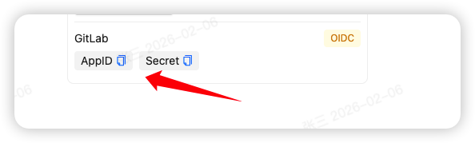
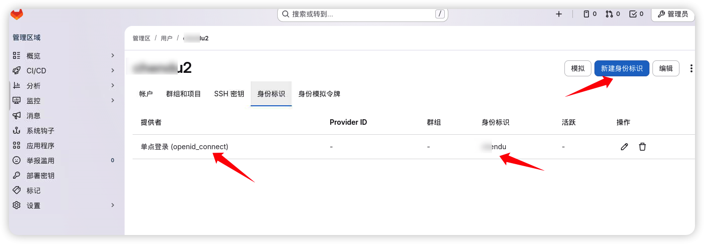

# GitLab 使用 JumpSSO 作为身份源

> 文档编辑于：2026-02-06

请先阅读：[添加 OIDC 入口](../README.md)

## 配置流程

安装好你的 GitLab 服务，得到你的地址，这就是你的入口地址，假设是：http://192.168.1.10:8080, 那么你的回调地址就是：

- http://192.168.1.10:8080/users/auth/openid_connect/callback

进入 JumpSSO，输入名称、地址，生成随机认证密钥，填入回调地址，用户标识姓名、昵称、手机号、拼音都可以，保存得到 AppID 和 Secret



再使用文本编辑 GitLab 的配置文件：/etc/gitlab.rb，输入下方配置，对应处修改成你的配置

```rb
gitlab_rails['omniauth_providers'] = [
  {
    name: "openid_connect",
    label: "单点登录", # 可修改，展示在登录页的按钮文字
    args: {
      name: "openid_connect",
      scope: ["openid", "profile", "email"],
      response_type: "code",
      issuer:  "https://<你的 JumpSSO 部署地址>/oidc",
      client_auth_method: "query",
      discovery: false,
      uid_field: "sub",
      client_options: {
        identifier: "<AppID>",
        secret: "<Secret>",
        redirect_uri: "<回调地址>"
        end_session_endpoint: "https://<你的 JumpSSO 部署地址>/oidc/session/end",
        authorization_endpoint: "https://<你的 JumpSSO 部署地址>/oidc/auth",
        token_endpoint: "https://<你的 JumpSSO 部署地址>/oidc/token",
        userinfo_endpoint: "https://<你的 JumpSSO 部署地址>/oidc/me",
        jwks_uri: "https://<你的 JumpSSO 部署地址>/oidc/jwks",
      },
    }
  },
]
```

如此，即可完成接入，重载 GitLab 配置后，可看到登录入口


完成配置后，进入 GitLab 管理后台的用户详细中，选择身份标识，添加一个 openid_connect 的身份标识，和 JumpSSO 配置处的标识保持一致即可。



## 其他

GitLab 版本为：v18.8.3，其他版本大差不差，其他版本大同小异，可先于测试服测试通过后，再使用到生产环境中。
