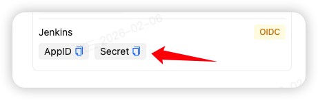
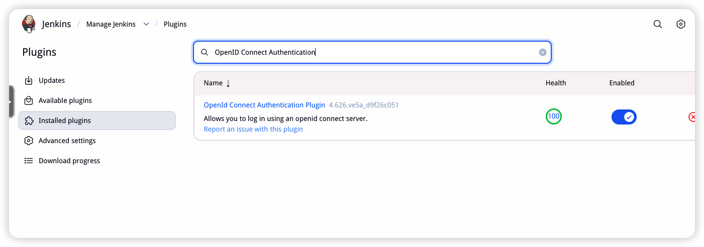
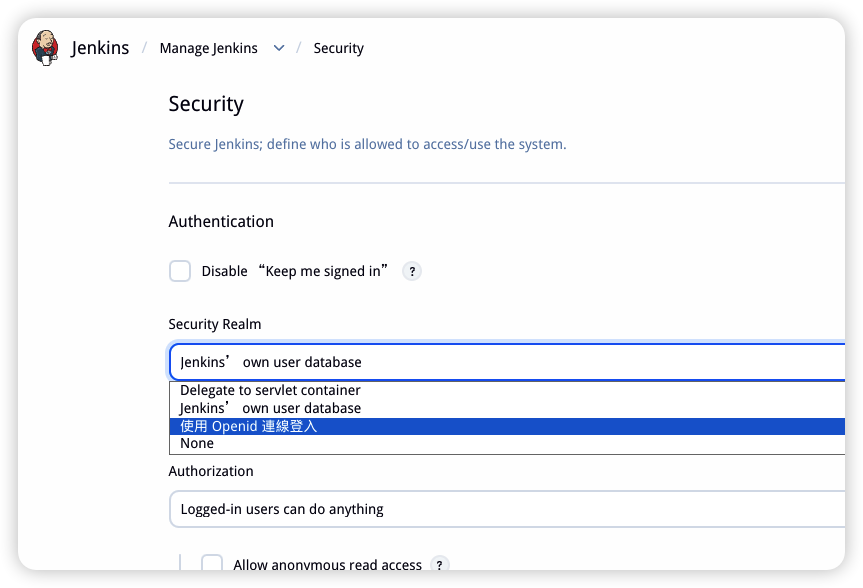

# Jenkins 使用 JumpSSO 作为身份源

> 文档编辑于：2026-02-06

请先阅读：[添加 OIDC 入口](../README.md)

## 配置流程

安装好你的 Jenkins 服务，得到对应地址，这就是你的入口地址，假设是：http://192.168.1.10:8080, 那么你的回调地址就是：

- http://192.168.1.10:8080/securityRealm/finishLogin

进入 JumpSSO，输入名称、地址，生成随机认证密钥，填入回调地址，用户标识姓名、昵称、手机号、拼音都可以，保存得到 AppID 和 Secret

进入 Jenkins Web 端页面：【System Configuration】-【Plugins】-【Available plugins】，搜索：OpenID Connect Authentication 并安装。

安装完成后，进入【Security】中，切换身份认证为 openid 登入

切换后，有一系列参数信息，根据你的信息填入：

| 参数                                | 设置值                                           | 说明                   |
| ----------------------------------- | ------------------------------------------------ | ---------------------- |
| Client id                           | AppID                                            | JumpSSO 入口 AppID     |
| Client secret                       | Secret                                           | JumpSSO 入口 Secret    |
| Configuration mode                  | Manual Entry                                     | 切换成手动选择         |
| Issuer                              | https://<你的 JumpSSO 部署地址>/oidc             | OIDC 服务地址          |
| Token server url                    | https://<你的 JumpSSO 部署地址>/oidc/token       | 客户端调用交换令牌     |
| Token Authentication Method         | Basic                                            | 交换方式               |
| Authorization server url            | https://<你的 JumpSSO 部署地址>/oidc/auth        | 客户端登录重定向       |
| UserInfo server url                 | https://<你的 JumpSSO 部署地址>/oidc/me          | 客户端调用获取用户信息 |
| Jwks server url                     | https://<你的 JumpSSO 部署地址>/oidc/jwks        | 客户端验证 ID Token    |
| End session URL for OpenID Provider | https://<你的 JumpSSO 部署地址>/oidc/session/end | 客户端登出时跳转       |
| Scopes                              | openid email                                     | 授权内容，默认即可     |

保存后，当你登录时将自动跳转 JumpSSO 进行登录，登录后的用户标识将对应 Jenkins 内的用户名。

## 其他

Jenkins 版本为：Version 2.549，其他版本大同小异，可先于测试服测试通过后，再使用到生产环境中。
