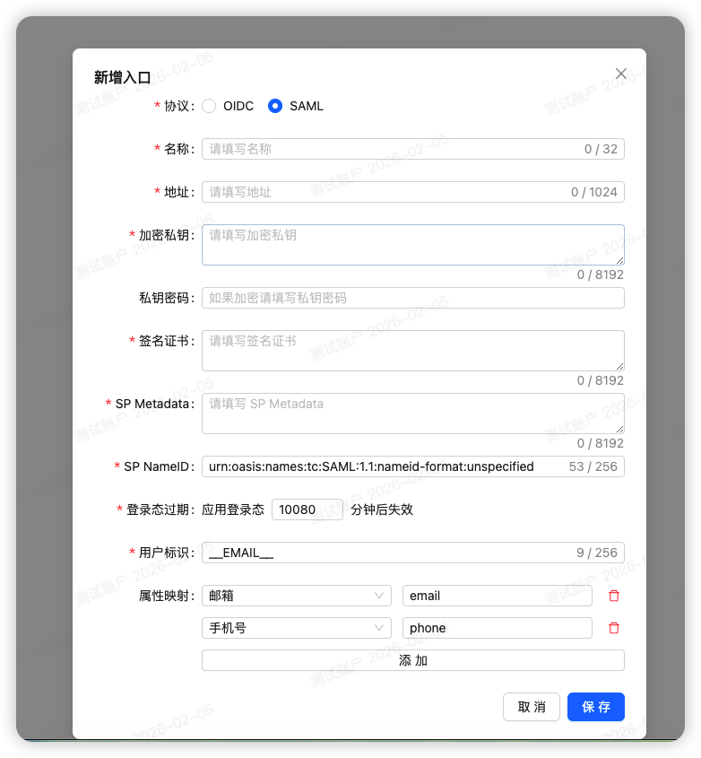

# 添加 SAML 入口

添加入口时选择 SAML，将有以下参数，详细填写参考下面说明



## 说明

### 基本信息

- 名称：入口名称，可填写该入口和应用的关系，比如阿里云-国际服
- 地址：入口地址，用户记录该入口从何处访问，比如阿里云：https://signin.aliyun.com/login.htm?username=@xxxx.onaliyun.com

### 私钥与证书

加密私钥、私钥密码、签名证书：需要手动生成（未来会内置此工具），可以选择本地生成：

```bash
# 生成私钥，pass:foobar 设置密码为 foobar
openssl genrsa -passout pass:foobar -out encryptKey.pem 4096

# 通过私钥生成证书
openssl req -new -x509 -key encryptKey.pem -out encryptionCert.cer -days 3650
```

也可以选择第三方在线生成的站点在线生成，自行搜索：在线生成自签名SSL证书/X509证书

生成后，得到私钥、私钥密码（如果有）和证书，拷贝粘贴即可。

### 服务商配置

- SP Metadata：在各个服务商开启 SAML 时会提供，为 xml 文件，拷贝填充即刻。
- SP NameID：默认的 nameid 指定，在服务未提供 NameID 值时的默认值，保持默认即可。
- 登录态过期：提供给服务商的用户登录过期时间，不一定有效，默认值为 7 天。

### 传递用户信息

#### 用户标识

返回给服务商的用户唯一标识，为灵活，提供了一些拼接的方式，有几个占位变量：

| 占位符           | 值         |
| ---------------- | ---------- |
| \_\_EMAIL\_\_    | 用户邮箱   |
| \_\_PHONE\_\_    | 用户手机号 |
| \_\_NAME\_\_     | 用户名称   |
| \_\_NICKNAME\_\_ | 用户昵称   |

这些值对应了用户页面添加的信息，一般情况下，使用邮箱或手机号作为唯一标识，但对于一些特定的服务商，需要用其他信息。

#### 属性映射

可以将 JumpSSO 用户对应的值返回给服务商，按需设置即可，大多数情况下用不到，因为单点登录的主要作用还是关联用户唯一标识。
