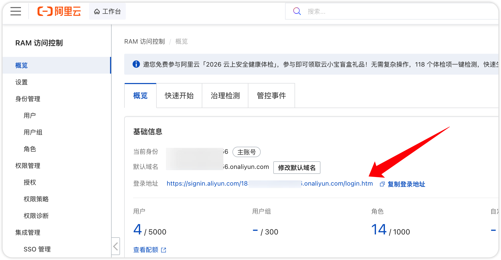
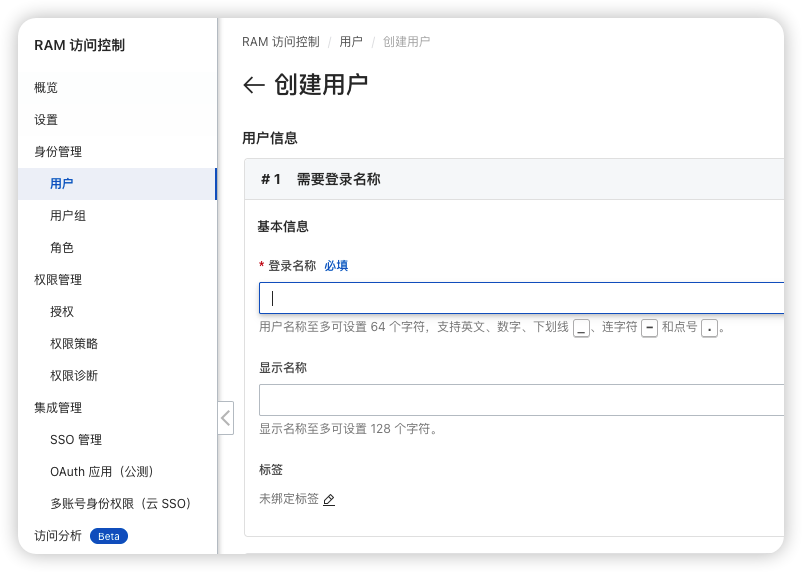
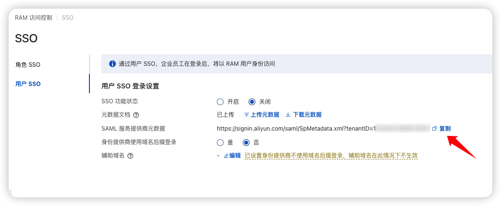
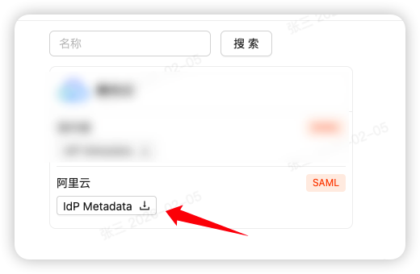
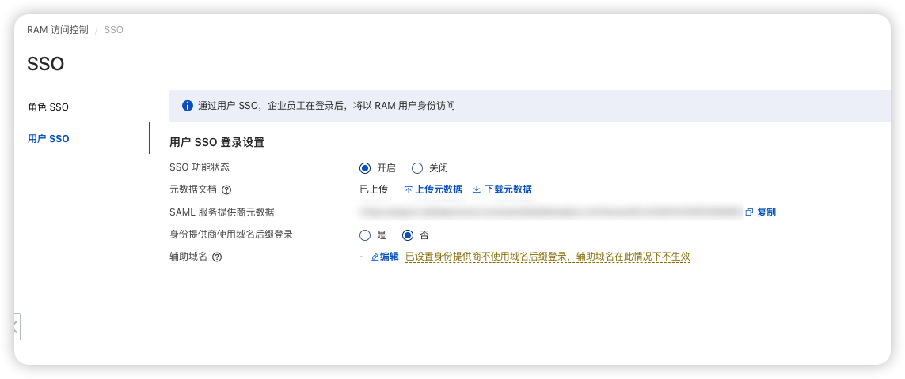
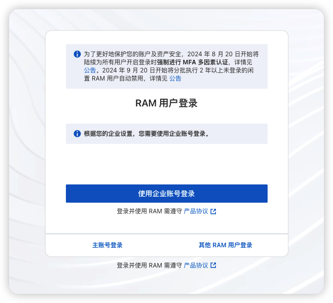

# 阿里云使用 JumpSSO 作为身份源

> 文档编辑于：2026-02-05

请先阅读：[添加 SAML 入口](../README.md)

## 国内

### 配置流程

登录阿里云后，进入【控制台】-【RAM 访问控制】，可以看到子用户的登录链接

进入：【控制台】-【身份管理】-【用户】，在这里创建子账户，创建时登录名称对应 JumpSSO 用户中的姓名、昵称、手机号、拼音都可以，在 JumpSSO 配置处的标识保持一致。

进入：【控制台】-【RAM 访问控制】-【SSO 管理】-【用户SSO】，获取 SAML 服务提供商元数据，点击复制粘贴到浏览器下载，得到 SpMetadata.xml

进入 JumpSSO，上述几步得到入口地址、Sp Metadata 和用户标识，在入口设置后保存，可下载得到 IdPMetadata.xml

再回到阿里云，进入【控制台】-【RAM 访问控制】-【SSO 管理】-【用户SSO】：

- SSO 功能状态：开启
- 元数据文档：上传 IdPMetadata.xml
- 身份提供商使用域名后缀登录：否

如此，即可完成接入，按照上面的例子，即可通过子用户的登录链接进行 SSO 登录

## 国际

国际配置的流程和国内相同，在这里就不介绍了。
