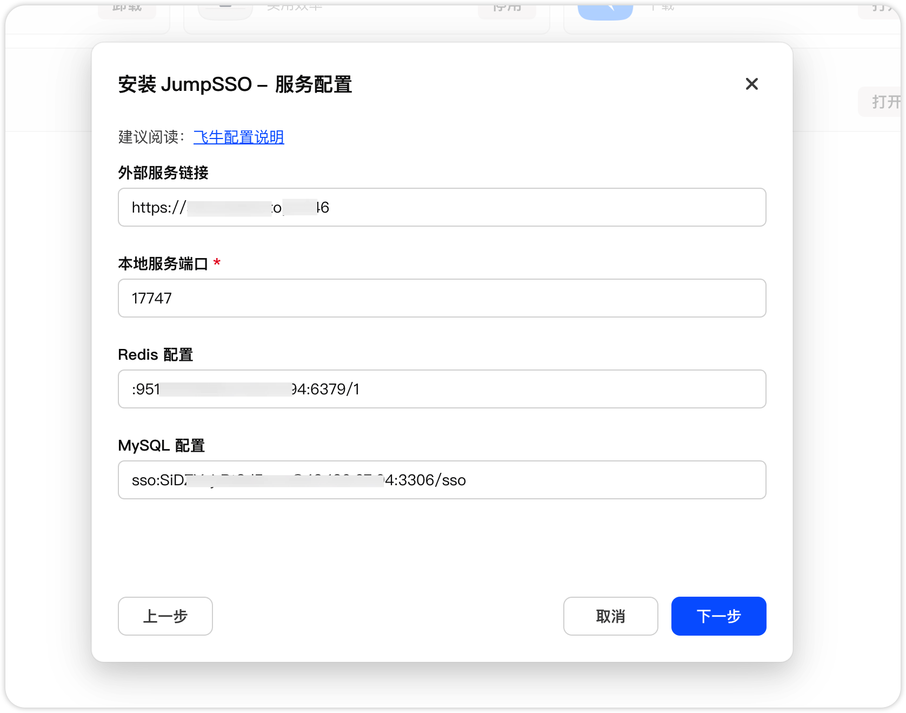

# 飞牛 NAS 部署 JumpSSO

直接在 Releases 中下载飞牛 fpk 包进行安装即可。

## 安装

安装时，将填写相关信息：

| 参数名       | 说明                                                                                                      |
| ------------ | --------------------------------------------------------------------------------------------------------- |
| 外部服务链接 | 可选，外部服务实际地址，可无后缀，http 默认 80，https 默认 443，默认 http://localhost:17746               |
| 本地服务端口 | 必选，本地部署的端口地址，访问时可内网 ip:端口 进行访问                                                   |
| Redis 配置   | 可选，使用 Redis 进行缓存，示例【username:password@host:port/database】、【:password@host:port/database】 |
| MySQL 配置   | 可选，使用 MySQL 进行存储，示例【username:password@host:port/database】                                   |

对于外部服务地址，一般情况下使用 https 反向代理，这里就需要填写对应的反向代理地址，用于客户端进行访问。

不过对于 nas 使用，可以不配置 Redis 和 MySQL，直接使用本地文件，客户端配置时使用 ip:端口 访问即可。

## 数据存储

安装完成后，在【文件管理】-【应用文件】-【jumpsso】中有2个文件夹：

| 参数名  | 说明                                                                                                                   |
| ------- | ---------------------------------------------------------------------------------------------------------------------- |
| runtime | 系统运行的缓存目录，存储了本地存储、本地缓存、上传图片、初始配置等运行时的文件，映射后，重置 docker 服务也不会丢失数据 |
| public  | 部署后静态资源文件，主要用于企微域名验证，假设部署为 a.com，public 下的 1.jpg 可 a.com/1.jpg 访问                      |

卸载重装不影响数据存储，初始密码存储在 【文件管理】-【应用文件】-【jumpsso/runtime/config.json】文件中，请注意，如果您在操作界面修改超级管理员密码，配置文件并不会同步更新

## 使用

[JumpSSO 使用说明](../../README.md)
