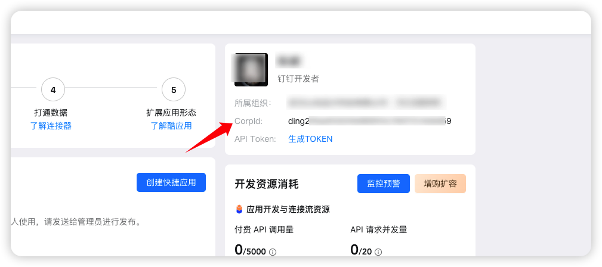
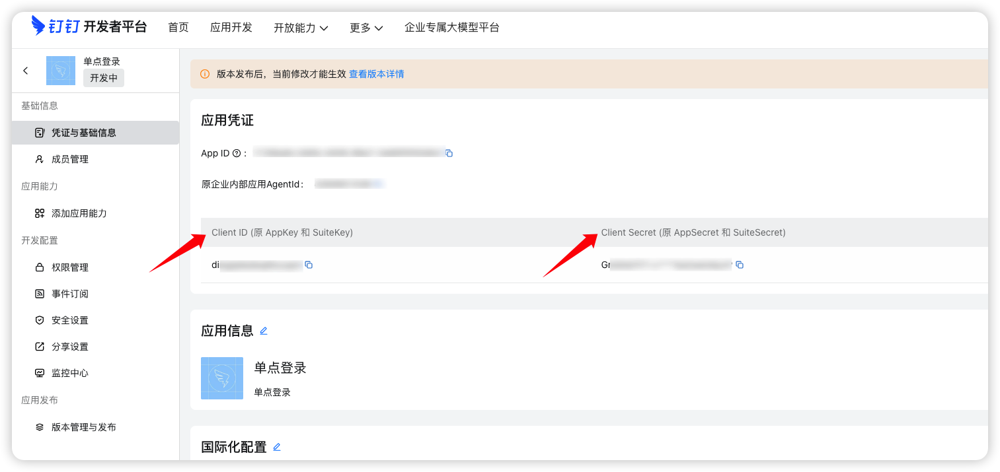
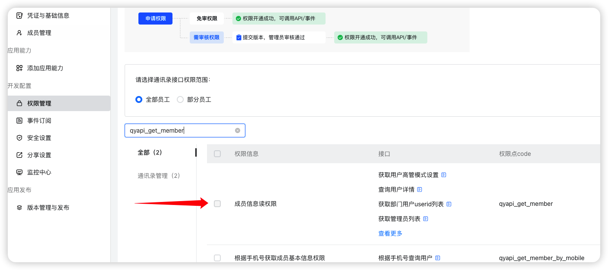
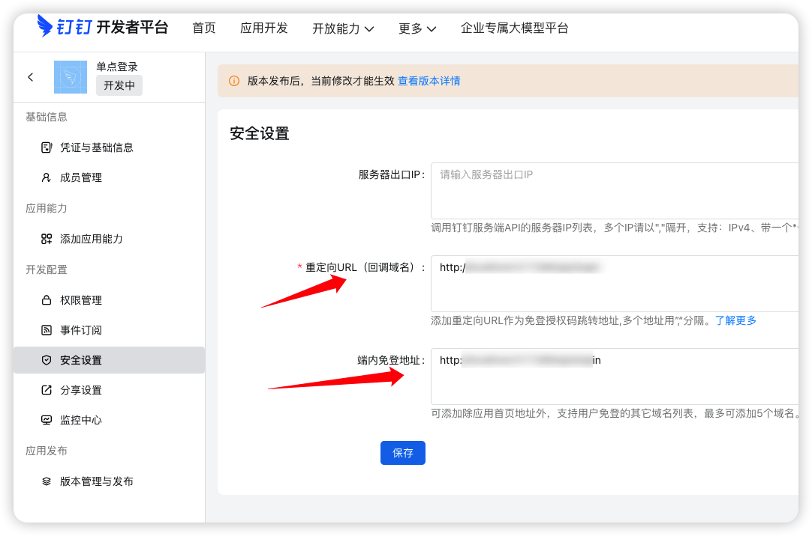
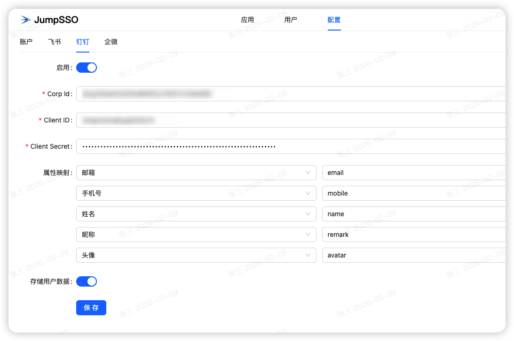
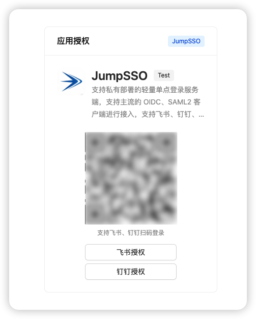
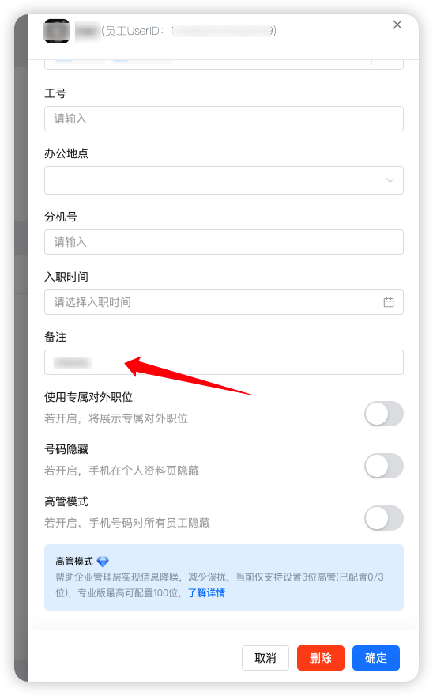

# JumpSSO 使用钉钉作为身份源

## 钉钉创建应用

进入钉钉的[开发者后台](https://open-dev.dingtalk.com)，使用管理员账户登录后，在首页可看到 CorpId

进入【应用开发】-【钉钉应用-【创建应用】，应用名称、应用描述和应用图标随意，创建后，进入应用详情，在【凭证与基础信息】中，可获取 Client ID 和 Client Secret

再进入【开发配置】-【权限管理】，搜索以下权限进行添加：

- fieldEmail 邮箱等个人信息
- fieldMobile 企业员工手机号信息
- qyapi_get_member 成员信息读权限

上述配置主要用于 JumpSSO 调用相应接口进行用户数据匹配

接着，再进入【开发配置】-【安全设置】中，给【重定向URL（回调域名）】、【端内免登地址】添加你的 JumpSSO 部署地址。

其实是需要添加端内免登地址，但回调域名必填，就一起都填吧。

至此，钉钉配置完成。

## JumpSSO 配置

进入 JumpSSO 配置页面中，进入钉钉配置项，打开启用，填入上述的 CorpId、Client ID 和 Client Secret；

属性映射建议保持不动，可参考[此接口响应体 result](https://open.dingtalk.com/document/development/query-user-details#h2-hoq-pdj-kaa)；

存储用户数据建议开启，可在用户中查看信息。

点击保存后即可进行钉钉扫码或唤起桌面端登录

若无需账户密码登录，则可在【配置】-【账户】中，关闭启用，则仅支持钉钉登录

## 其他

钉钉备注可以设置成自定义值然后使用，比如拼音，备注在用户管理此处配置

