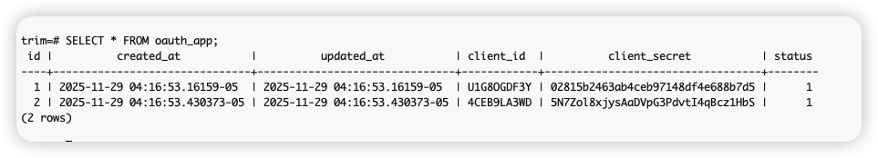
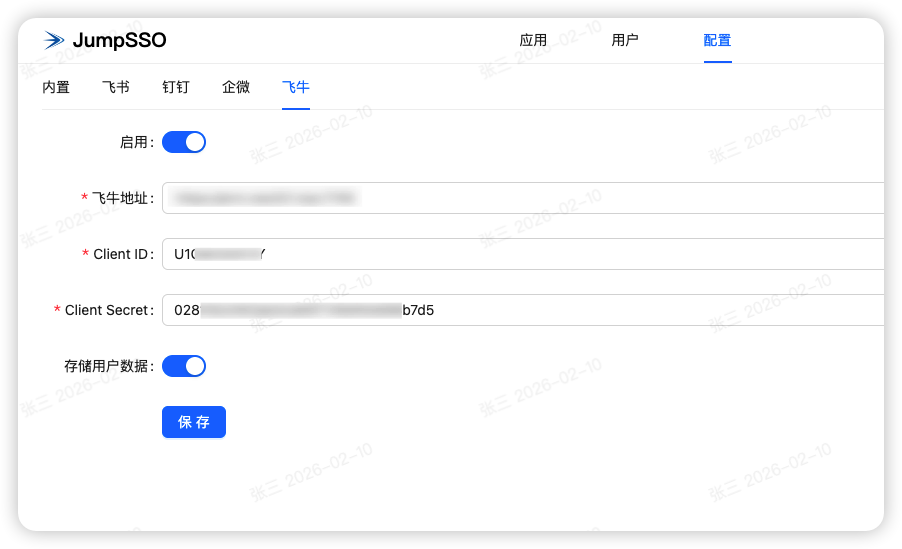
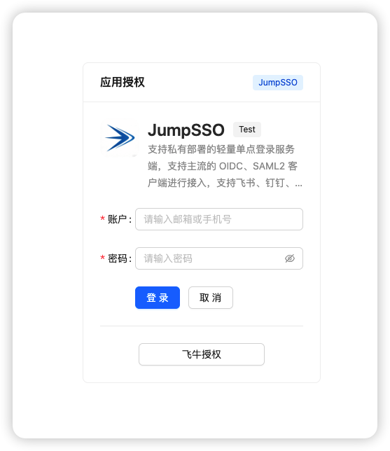
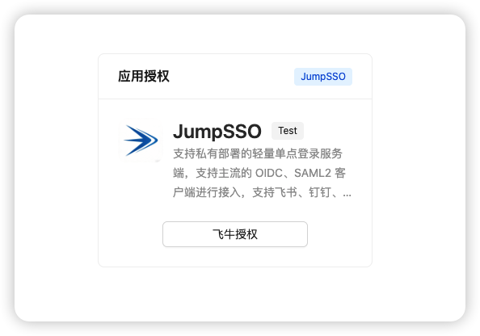

# JumpSSO 使用飞牛作为身份源

## 飞牛应用信息

目前飞牛没有开放 OAuth，但是根据网上的资料，可以使用飞牛影视的 Client ID 和 Client Secret，都是这个信息：

- Client ID：U1G8OGDF3Y
- Client Secret：02815b2463ab4ceb97148df4e688b7d5

此方法虽然可用，但是可能随时会被封堵，后续待飞牛更新后，可以替换成本应用的信息

如果你的登录流程有问题，可以获取本机的，ssh 进机器然后 sudo 为 root 用户后，操作为以下命令，：

```bash
psql -U postgres -d trim

SELECT * FROM oauth_app;

\q  # 退出 psql
```



## JumpSSO 配置

进入 JumpSSO 配置页面中，进入飞牛配置项，打开启用，填入你的飞牛部署地址、Client ID 和 Client Secret；

存储用户数据建议开启，可在用户中查看信息。



点击保存后即可进行飞牛授权登录



若无需账户密码登录，则可在【配置】-【账户】中，关闭启用，则仅支持飞牛登录



## 其他

飞牛的返回的信息比较少，只有 uid 和名称，所以如果你要用飞牛作为身份源，请选择使用 \_\_NAME\_\_ 或 \_\_NICKNAME\_\_ 作为用户标识
