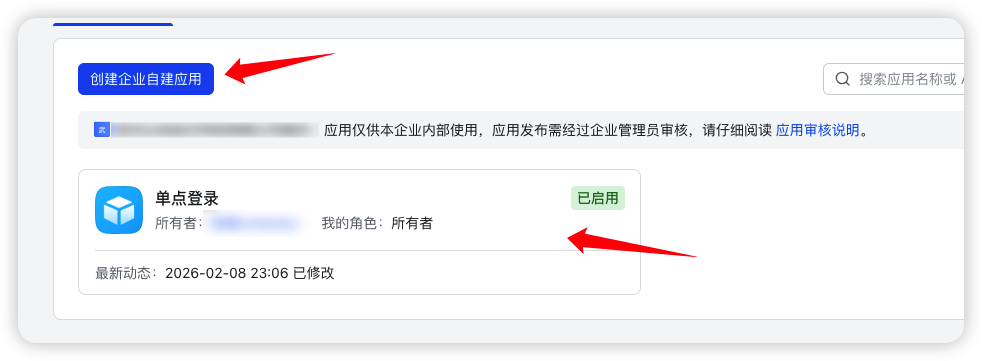
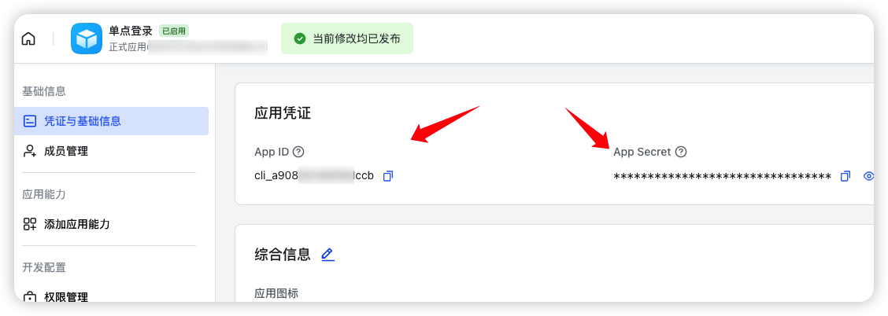
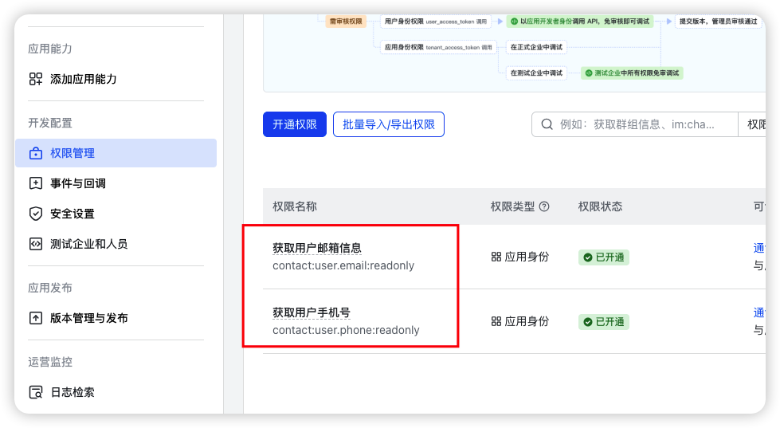
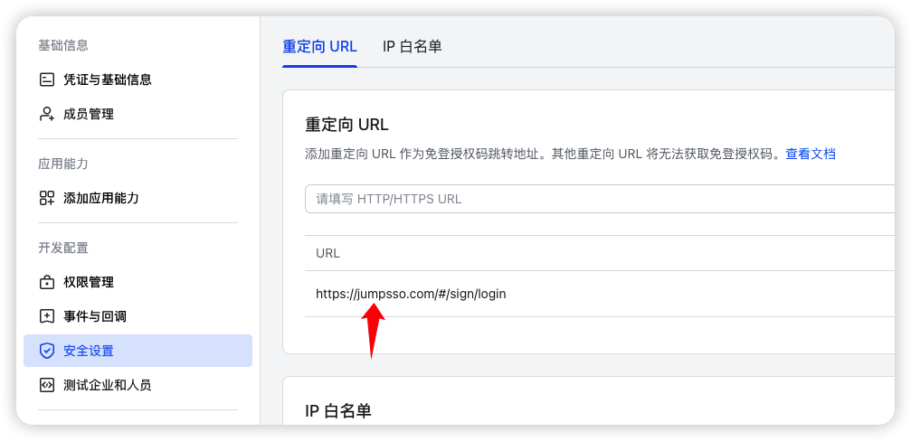
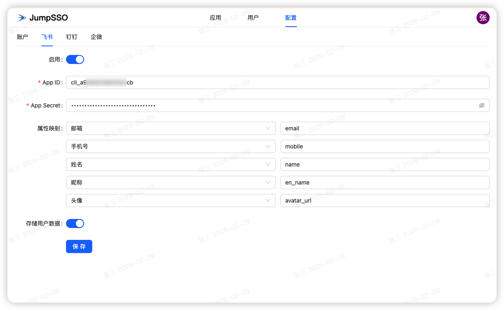
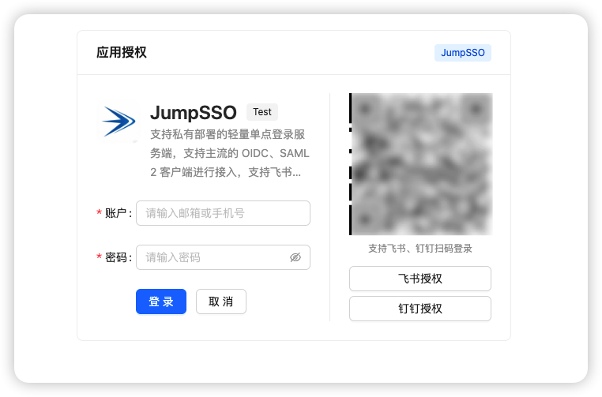
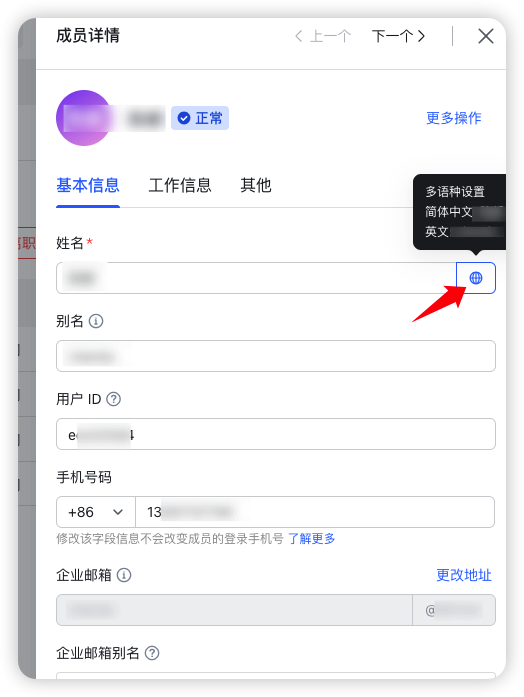

# JumpSSO 使用飞书作为身份源

## 飞书创建应用

进入飞书的[开发者后台](https://open.feishu.cn/app)，使用管理员账户登录后，进入【企业自建应用】，点击【创建企业自建应用】进行应用创建，应用名称、应用描述和应用图标随意。

创建后，点击应用进入详情，在【凭证与基础信息】中，可获取 App ID 和 App Secret

再进入【开发配置】-【权限管理】，点击【开通权限】，搜索以下权限进行添加：

- contact:user.email:readonly 获取用户邮箱信息
- contact:user.phone:readonly 获取用户手机号

上述配置主要用于 JumpSSO 调用相应接口进行用户数据匹配

接着，再进入【开发配置】-【安全设置】-【重定向 URL】中，添加 URL：

- https://<你的 JumpSSO 部署地址>/#/sign/login

至此，飞书配置完成。

## JumpSSO 配置

进入 JumpSSO 配置页面中，进入飞书配置项，打开启用，填入上述的 App ID 和 App Secret；

属性映射建议保持不动，可参考[此接口响应体 data](https://open.feishu.cn/document/server-docs/authentication-management/login-state-management/get#responseBody)；

存储用户数据建议开启，可在用户中查看信息。

点击保存后即可进行飞书扫码或唤起桌面端登录

若无需账户密码登录，则可在【配置】-【账户】中，关闭启用，则仅支持飞书登录

## 其他

飞书英文名称可以设置成自定义值然后使用，比如拼音，英文名在用户管理此处配置

