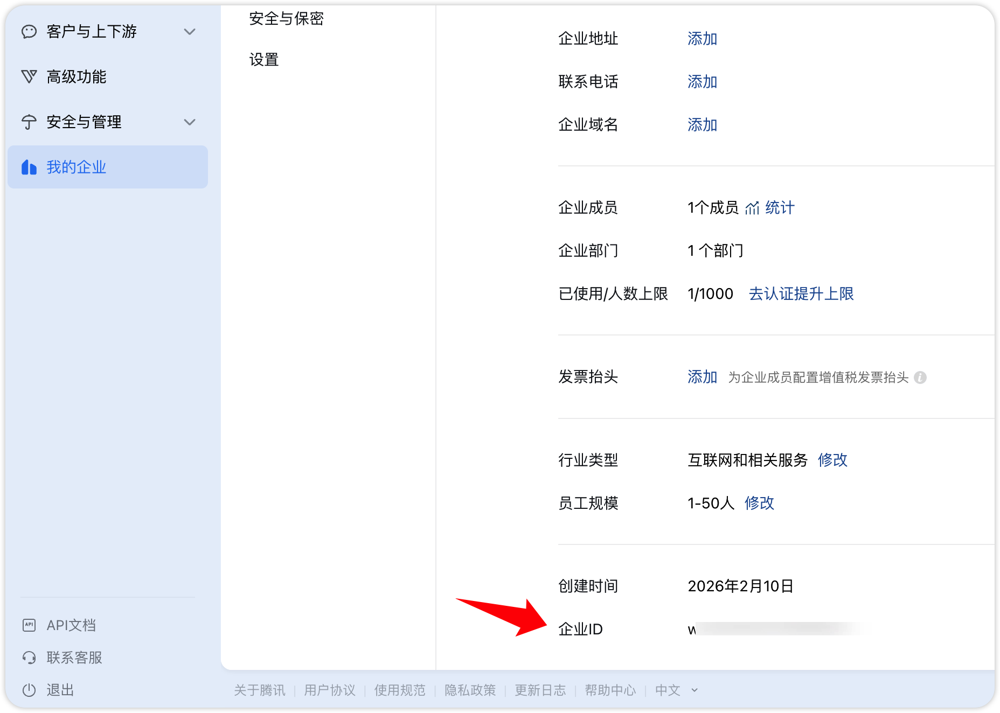
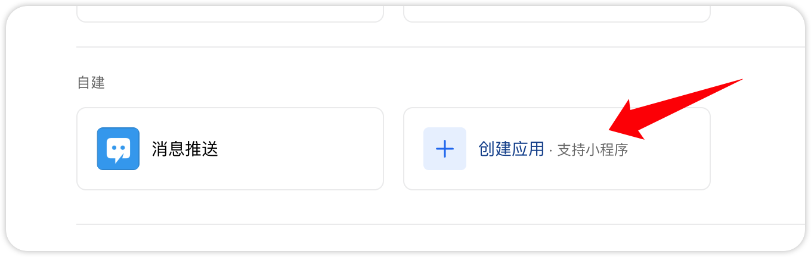
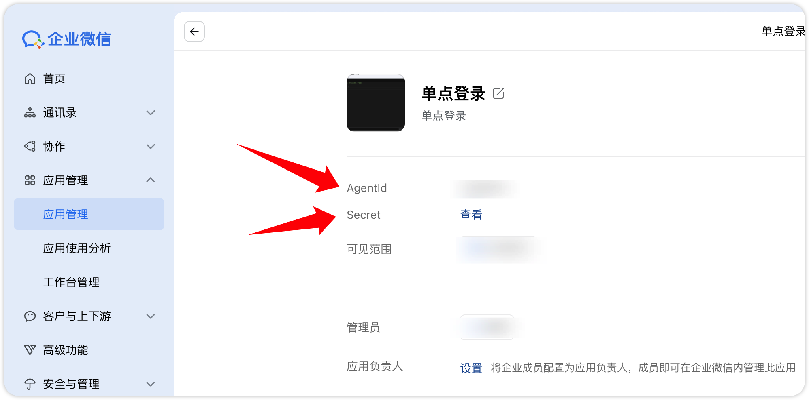
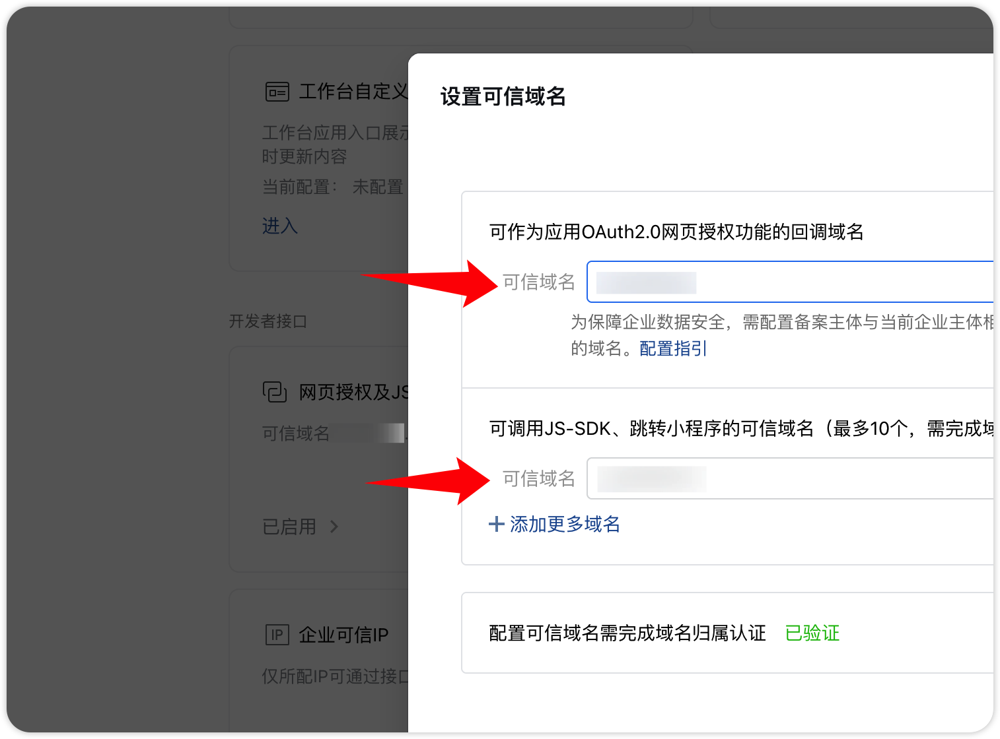
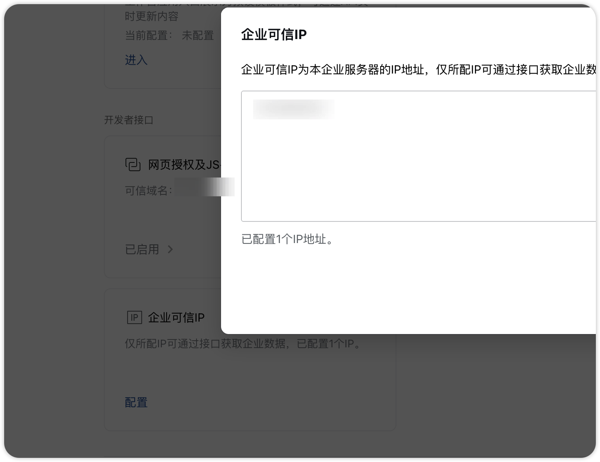
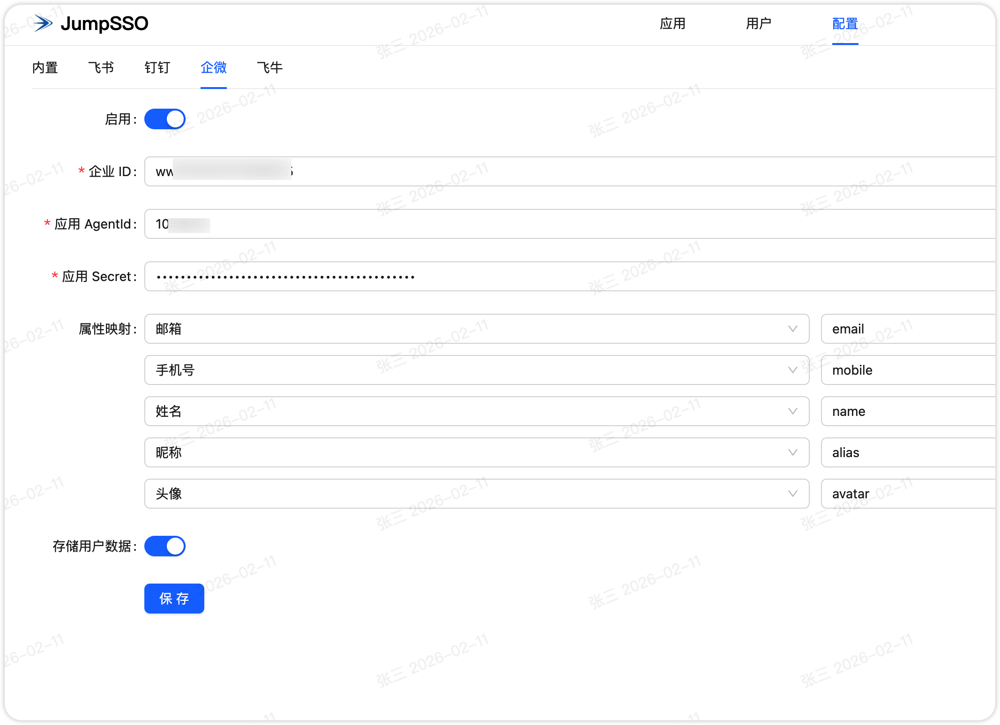
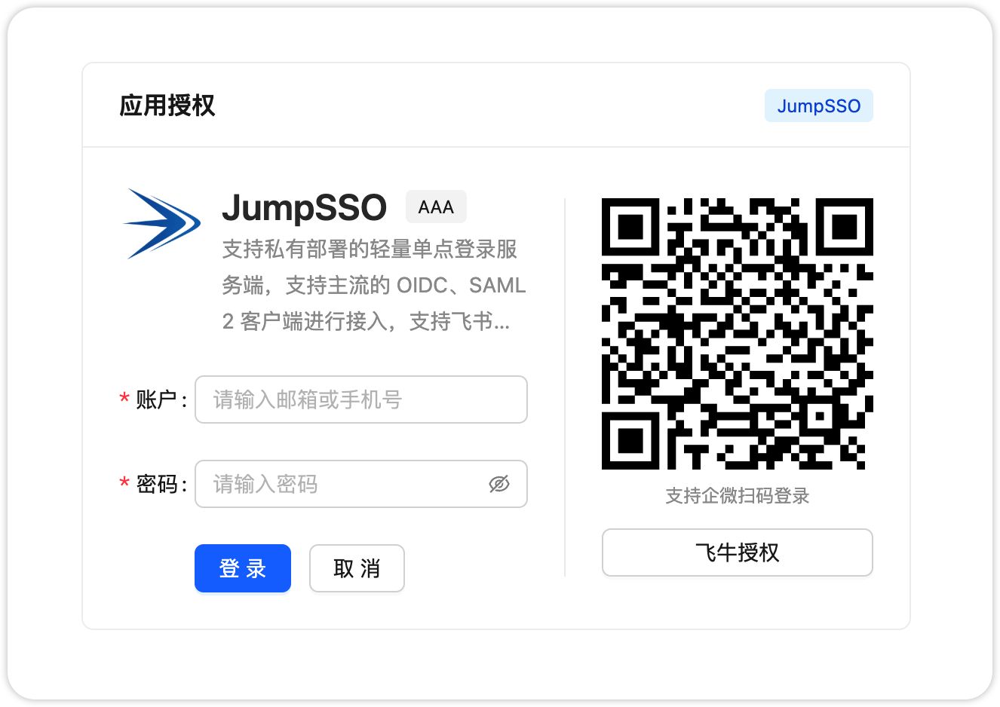
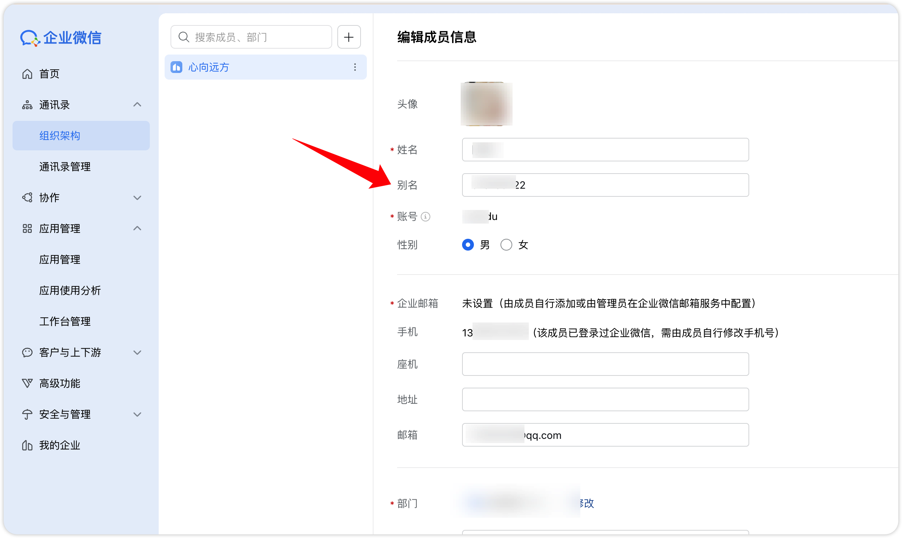

# JumpSSO 使用企微作为身份源

> 企微要求你的 JumpSSO 需要部署在公网且 IP 固定

## 企微创建应用

使用管理员进入企微的[管理后台](https://work.weixin.qq.com/wework_admin/frame)，左侧【我的企业】-【企业信息】，进入后最下方可得到企业 ID

进入【应用管理】-【应用】-【自建】，点击【创建应用】进行应用创建，应用名称、应用描述和应用图标随意。

创建后，点击应用进入详情，可获取应用 AgentId 和应用 Secret

再往下方【开发者接口】-【网页授权及JS-SDK】，在两处【可信域名】中都填入你的 JumpSSO 部署域名

验证域名可将文件上传至 JumpSSO 根目录 public 下。

再往下方【开发者接口】-【企业可信IP】，添加你的 JumpSSO 部署机器的 IP 地址。

至此，企微配置完成。

## JumpSSO 配置

进入 JumpSSO 配置页面中，进入企微配置项，打开启用，填入上述的 企业 ID、应用 AgentId 和 应用 Secret；

属性映射建议保持不动，可参考[基础信息](https://developer.work.weixin.qq.com/document/path/90196)、[敏感信息](https://developer.work.weixin.qq.com/document/path/95833)的结构返回；

存储用户数据建议开启，可在用户中查看信息。

点击保存后即可进行企微扫码或唤起桌面端登录

若无需账户密码登录，则可在【配置】-【账户】中，关闭启用，则仅支持企微登录

## 其他

企微别名可以设置成自定义值然后使用，比如拼音，别名在用户管理此处配置

